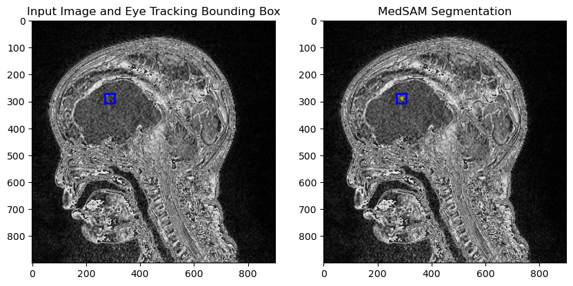
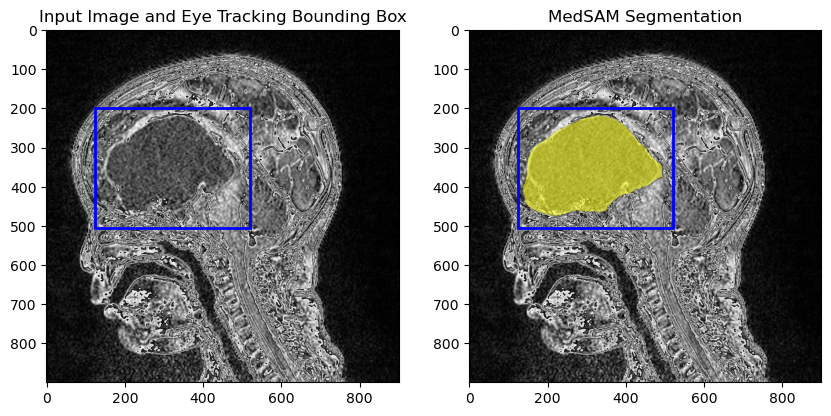

  
   
  <i>Example of bounding box generated directly from eye tracking data with downstream MedSAM output.</i>

  
   
  <i>Example of bounding box generated by manual annotation with downstream MedSAM output.</i>

  
   
  <i>Bounding boxes identified by `cv2.findContours` and `cv2.boundingRect` with no eye tracking or manual annotation information.</i>

