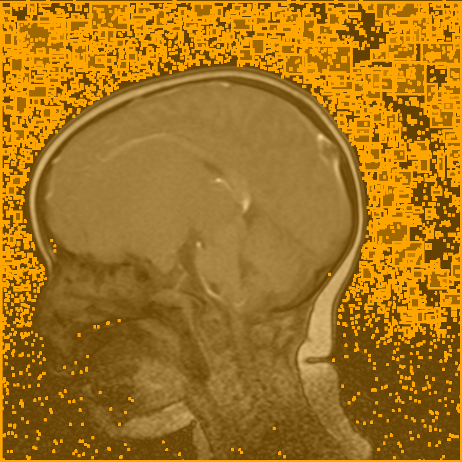

## Bounding Box Generation for MedSAM Input

Our initial idea was to aggregate eye tracking information for a given image and use that to create the bounding box to be used as an input for MedSAM. An example of the results of this approach can be seen in Figure 1.

  
   
  <i>Figure 1. Example of bounding box generated directly from eye tracking data with downstream MedSAM output.</i>

We can see that the bounding box lands central to the tumor mass of the patient, which is accurate. However, we do not observe enough variance in the eye tracking data to create a bounding box large enough to capture the whole mass. This is because the MedSAM input will only segment objects within the bounding box, not outside of it.

Figure 2 displays an example of the ideal annotation and bounding box for the same image. This result suggests that MedSAM is capable of segmenting the tumor mask given the appropriate bounding box. The sensitivity of this bounding box selection was observed when constructing Figure 2.  Slightly smaller or larger bounding boxes will result in unique segmentation maps.

  
   
  <i>Figure 2. Example of bounding box generated by manual annotation with downstream MedSAM output.</i>

There are several methods to generate bounding boxes on images given a seed location or a seed bounding box. Here are a few options:

- _Region Growing_: This is a pixel-based image segmentation method whereby the region is iteratively grown by comparison of all unallocated neighboring pixels to the region. The difference between a pixel’s intensity value and the region’s mean, δ, is used as a measure of similarity. The pixel with the smallest difference measured this way is allocated to the respective region. This process continues until all pixels are allocated to the region.

 - _Watershed Transformation_: This is a technique used for image segmentation. It considers the gradient magnitude of an image as a topographic surface. Pixels having the highest gradient magnitude intensities (GMIs) correspond to watershed lines, which represent the region boundaries.

 - _Active Contour Model (Snake)_: This is an energy-minimizing spline guided by external constraint forces and influenced by image forces that pull it toward features such as lines and edges. The snake is initialized by a seed bounding box.

 - _GrabCut_: This is an algorithm to extract the foreground of an image from the background. It takes a bounding box as input and returns a binary mask of the same size as the input image.

 - _Mean Shift and CAMShift_: These are algorithms used for tracking objects in a video. They can also be used to generate a bounding box around an object in an image given a seed location.

 - _Deep Learning Based Methods_: There are many deep learning models like Faster R-CNN, YOLO, SSD, etc., which can generate bounding boxes around objects in an i.mage. However, these models usually require a large amount of annotated data for training.
 
A simple example of _region growing_ can be derived using the `cv2.findContours` function. Our initial attempt at this approach resulted in Figure 3. We can see that all of the ROIs identified fell outside of the actual ROI. We probably need to revisit this.

  
   
  <i>Figure 3. Bounding boxes identified by `cv2.findContours` and `cv2.boundingRect` with no eye tracking or manual annotation information.</i>

### Algorithm to Expand Bounding Box use Sobel Edge Detection

  
   
  <i>Figure 3. Gaze-based bounding box overlayed on image processed by Sobel edge detection algorithm.</i>

